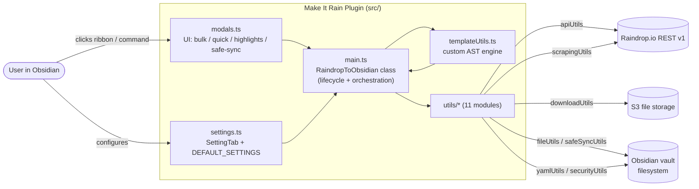

# Architecture

> High-level topology of **Make It Rain** — what connects to what, what owns what.
> For domain details, see [AGENTS.md](AGENTS.md) → Documentation.

## Bird's Eye View

Make It Rain is an Obsidian plugin (TypeScript, esbuild, Jest) that pulls Raindrop.io
bookmarks, highlights, tags, and file attachments into a user-owned local vault of
Markdown notes. It runs inside the Obsidian desktop/mobile app and uses Obsidian's
`app.vault` API for all persistence.



## Data Flow

```
[Raindrop.io API]
  │
  │ 1. fetchWithRetry + RateLimiter          (apiUtils)
  ▼
[Raw Raindrop items + Group/Collection tree]
  │
  │ 2. resolve path via parent traversal      (apiUtils.getFullPathSegments)
  ▼
[Path-mapped items: title, link, tags, cover, highlights, file ref]
  │
  │ 3. render via AST template                 (templateUtils + content-type templates)
  │    sanitize content                        (securityUtils)
  │    build YAML frontmatter                  (yamlUtils)
  ▼
[Markdown string + optional binary ArrayBuffer]
  │
  │ 4. write note + folder note + binary file  (fileUtils, downloadUtils)
  │    optionally reconcile vs vault           (safeSyncUtils)
  ▼
[Obsidian vault]
```

## Module Boundaries (Layering)

Dependency direction is strictly **downward** (top rows depend on bottom rows; never
the reverse):

| Layer | Modules | Owns |
| --- | --- | --- |
| **UI** | `modals.ts`, `settings.ts` | User input, modals, setting tab rendering |
| **Orchestration** | `main.ts` | Plugin lifecycle, command registration, import workflows |
| **Domain Logic** | `templateUtils.ts`, `template-validator.ts`, `utils/safeSyncUtils.ts`, `utils/downloadUtils.ts` | Pure logic; no Obsidian or network calls |
| **Adapters** | `utils/apiUtils.ts`, `utils/scrapingUtils.ts`, `utils/fileUtils.ts`, `utils/yamlUtils.ts`, `utils/formatUtils.ts`, `utils/securityUtils.ts` | I/O — network, vault, serialization |
| **Foundation** | `types.ts`, `utils/index.ts` | Type definitions and centralized re-exports |

**Rule**: UI and orchestration may import from any lower layer. Lower layers
**must not** import from UI or orchestration. Adapters must not import from
domain logic (e.g. `apiUtils` must not import `templateUtils`).

## Sub-System: Template Engine

A custom **nesting-aware AST parser** (`templateUtils.ts` + `template-validator.ts`),
intentionally chosen over Handlebars/Mustache to avoid a runtime dependency for what
is fundamentally a small DSL. Supports:

- `{{var}}` — variable substitution
- `{{#if cond}}…{{else}}…{{/if}}` — conditional
- `{{#each arr}}…{{/each}}` — iteration
- Pre-computed helpers: `{{domain}}`, `{{renderedType}}`, `{{formattedCreatedDate}}`,
  `{{formattedUpdatedDate}}`, `{{formattedTags}}`

Templates are configured per content type (`link | article | image | video | document
| audio | book`) with per-type toggles; the modal flow allows temporary overrides at
import time.

## Sub-System: Safe Sync (Issue #9)

`safeSyncUtils.ts` reconciles local notes (matched by Raindrop ID in YAML
frontmatter) against the current remote state. The architecture splits detection
into `{deleted, unknown}` buckets; **never auto-acts on ambiguous cases** — those
go to a review modal for human decision (archive, remove, or skip).

## Architecture Invariants

1. **Rate-limited API access** — every Raindrop.io call goes through
   `apiUtils.createRateLimiter` (default 60 req/min) and `fetchWithRetry` (handles
   429 + transient network errors with backoff).
2. **Path safety** — all file/folder names derived from user content are sanitized
   via `fileUtils.sanitizeFileName` before any `app.vault` call.
3. **Decoupled templates** — render logic lives in `templateUtils`; data fetching
   in `apiUtils`; neither knows about the other's internals.
4. **Failsafe batch** — per-item errors are caught and surfaced via `Notice` + log;
   the batch continues.
5. **YAML integrity** — frontmatter generation always goes through `yamlUtils`
   (reserved-word force-quoting, null-keyword quoting, type-coercion-safe
   serialization).
6. **Content sanitization** — anything rendered into the note body from remote
   sources passes through `securityUtils.sanitizeMarkdownContent` (defangs
   executable code, blocks script tags).

## External Integration Points

- **Raindrop.io REST API v1** — collections, raindrops, file downloads; auth via
  Bearer token in `Authorization` header.
- **S3** (via Raindrop file links) — download path follows HTTP 303 redirects with
  the `Authorization` header stripped on the second hop (`downloadUtils`).
- **Obsidian `app.vault` API** — `create`, `createBinary`, `adapter`, `normalizePath`.

## Cross-Cutting Concerns

- **Testing**: Jest + ts-jest + jsdom. Obsidian and Raindrop APIs are mocked in
  `tests/setup.ts` and `tests/mocks/`. Per-utility unit tests + a couple of
  integration tests + one performance benchmark.
- **CI**: GitHub Actions (`.github/workflows/ci.yml`) — Node 24, secret scan,
  tests, coverage upload to Codecov, build verification.
- **Build**: esbuild bundles `src/main.ts` → `main.js` (CommonJS, ES2018, externalizes
  `obsidian` + Electron builtins). `manifest.json` ships from repo root.
- **Documentation site**: `docs/` is a Jekyll site published to GitHub Pages by
  `.github/workflows/jekyll-gh-pages.yml`. **Harness files in `docs/` (designs,
  plans, references) are excluded from that site** via `_config.yml`.

For deeper conventions, see the docs linked in [AGENTS.md](AGENTS.md).
