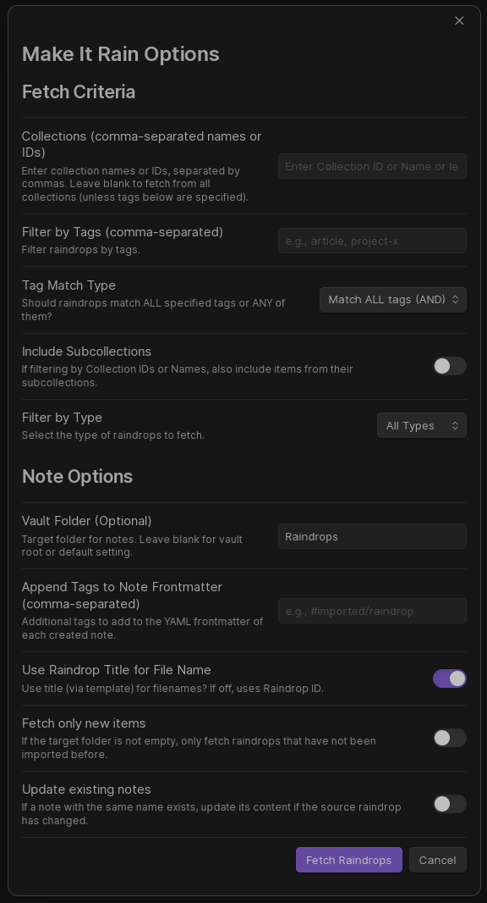

# Usage Guide

This guide explains how to use the Make It Rain plugin to fetch your raindrop.io bookmarks into Obsidian.

## Getting Started

Before using the plugin, ensure you have:

1. [Installed the plugin](installation.md)
2. [Configured your API token](configuration.md#raindropio-api-token)
3. Set your [default raindrop location](configuration.md#default-raindrop-location) (optional)

## Opening the Import Modals

Make It Rain provides two main ways to import your bookmarks, each with its own modal:

1. **Fetch raindrops (filtered) (for bulk/filtered imports)**:
    * Access via **Command Palette**: Press `Ctrl+P` (or `Cmd+P` on Mac) and search for "Make It Rain: Fetch raindrops (filtered)".
    * Access via **Ribbon Icon**: Click the raindrop icon in the left sidebar (if enabled in plugin settings).
2. **Quick import raindrop by url/id (for single item imports)**:
    * Access via **Command Palette**: Press `Ctrl+P` (or `Cmd+P` on Mac) and search for "Make It Rain: Quick import raindrop by url/id".
3. **Aggregate highlights by tag (for consolidating research)**:
    * Access via **Command Palette**: Press `Ctrl+P` (or `Cmd+P` on Mac) and search for "Make It Rain: Aggregate highlights by tag".

## Fetch Raindrops Modal Options


The "Fetch raindrops" modal is designed for bulk imports and provides several options for filtering and organizing your raindrops:

### Target Location

* **Vault save location (optional)**: Choose where in your vault to save the imported raindrops.
  * Default is the path specified in your plugin settings.
  * You can change this for each import session.

### Advanced Options (Collapsible)

To keep the interface clean, secondary options are now grouped in a collapsible "Advanced options" section:

* **Use raindrop title for file name**: Toggle to use raindrop titles as filenames.
  * When enabled: Uses the title (via filename template from settings) for filenames.
  * When disabled: Uses the raindrop id for filenames.

* **Append tags to notes**: Add custom tags to all imported notes.
  * Example: `#imported/raindrop, #web-content`
  * These tags are added in addition to any tags from raindrop.io.

* **Fetch only new raindrops**: Only import raindrops that don't exist in the target folder.
  * Useful for incremental imports without duplicates.

* **Update existing notes**: Update notes if the source raindrop has changed.
  * Compares the `last_update` timestamp from raindrop.io.
  * Only updates if the raindrop is newer than the existing note.

* **Note Template Overrides**: Temporarily override your global template settings for this specific import session.

### Filter Options

* **Filter by collections**: You can select collections from a dynamic, searchable list.
  * Use the search box to find specific collections.
  * Click a collection in the list to add it to the filter.
  * Collections are sorted alphabetically by their full path.
  * Leave empty to fetch from all collections (default behavior if no collections are specified).

* **Include subcollections**: Toggle to include raindrops from subcollections.
  * When enabled, fetches raindrops from all nested collections for all selected filters.
  * Maintains proper folder hierarchy in your vault.

* **Filter by tags**: Enter tags to filter by (comma-separated, case sensitive).
  * Example: `research, important, to-read`

* **Tag match type**: Choose between **Match all tags (and)** or **Match any tag (or)**.

* **Filter by type**: Select a specific content type.
  * Options: All types, Link, Article, Image, Video, Document, Audio, Book.

### Automated Features

When fetching, the plugin automatically handles:

- **Archive Scraping**: If enabled in settings, the plugin will attempt to pull full content for articles.
- **File Downloads**: Authenticated retrieval of PDF, EPUB, and media attachments.
- **Folder Notes**: Generation of index files for collection folders.

## Fetching Process (Bulk/Filtered Import)

After configuring your options in the "Fetch raindrops" modal:

1. Click the **Fetch raindrops** button.
2. A loading notice will appear showing progress.
3. The plugin will:
   * Fetch collections data from raindrop.io.
   * Fetch raindrops based on your filters.
   * Create the necessary folder structure in your vault.
   * Generate notes for each raindrop.
4. When complete, a notice will show the number of notes created, updated, or skipped.

## Quick Import Raindrop by URL/ID



This command allows you to quickly import a single raindrop item if you know its URL or unique numeric id.

### Accessing Quick Import

1. Open the Obsidian **Command Palette** (`Ctrl+P` or `Cmd+P` on Mac).
2. Search for and select the command: **"Quick import raindrop by URL or ID"**.

### Quick Import Modal Options

A simplified modal will appear with the following options:

* **Raindrop url or id**:
  * Paste the full URL of the raindrop item or just its unique numeric id.
  * **How to find**: In the raindrop.io app, click "Edit" on the specific item. The URL in your browser's address bar should look like `.../item/[ID]/edit`.
* **Vault save location (optional)**:
  * Override the default save folder (from plugin settings) for this specific import.
* **Append tags to notes (optional)**:
  * Enter comma-separated tags to add to the frontmatter of the created note for this item.

### Fetching the Single Item

1. Click the **Import** button in the quick import modal.
2. The plugin will fetch the specified raindrop item and create a note for it based on your template settings.

## Aggregate Highlights by Tag

This command is designed for researchers and heavy highlight users who want to consolidate all highlights from bookmarks sharing a specific tag into a single summary note.

### Accessing Aggregate Highlights

1. Open the Obsidian **Command Palette** (`Ctrl+P` or `Cmd+P` on Mac).
2. Search for and select the command: **"Aggregate highlights by tag"**.

### Aggregation Options

A modal will appear with the following options:

* **Tag to aggregate**:
  * Enter the exact tag name you want to collect highlights for.
* **Vault save location (optional)**:
  * Specify where to save the generated summary note. Defaults to the plugin's default save folder.

### Aggregation Process

1. Click the **Aggregate** button.
2. The plugin will scan your vault for notes containing the specified tag.
3. It extracts all highlights (and associated notes) from these files.
4. It generates a single new note titled `Highlights for [Tag].md` containing the consolidated list.

## Understanding the Results

After fetching, you'll see a summary of the operation:

* **Created**: New notes that were created.
* **Updated**: Existing notes that were updated.
* **Skipped**: Raindrops that were skipped (due to "Fetch Only New" or no changes).
* **Errors**: Any errors that occurred during the process.

## Folder Organization

The plugin organizes your notes based on your Raindrop.io collection hierarchy:

1. **Root Folder**: The vault path you specified.
2. **Collection Folders**: Subfolders created for each collection.
3. **Nested Collections**: Maintains the same hierarchy as in Raindrop.io.

For example, if you have:

* A collection "Research" with a subcollection "AI"
* And you set your vault path to "Raindrops"

The resulting structure will be:

```
Raindrops/
├── Research/
│   └── AI/
│       ├── Article1.md
│       └── Article2.md
└── Other collections...
```

## Advanced Usage

### Rate Limiting

The plugin includes smart rate limiting to avoid hitting Raindrop.io API limits:

* Limits requests to 60 per minute (conservative approach).
* Automatically waits when rate limits are reached.
* Shows notifications during rate limit delays.
* Retries failed requests with exponential backoff.

### Working with Large Collections

When working with large collections:

1. **Use Specific Filters**: Target specific collections or tags.
2. **Incremental Imports**: Use "Fetch Only New" to add items gradually.

## Next Steps

* Learn about [note structure and the template system](template-system.md).
* Check the [troubleshooting guide](troubleshooting.md) if you encounter issues.
* Explore [configuration options](configuration.md) to customize the plugin.
